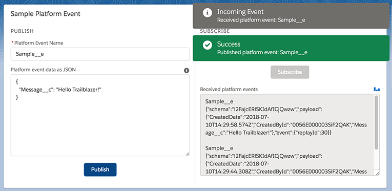
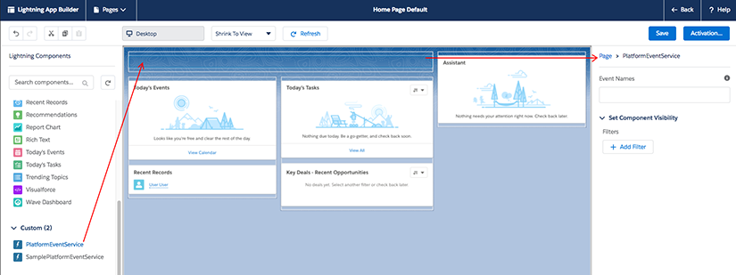

# Salesforce Lightning Platform Event Service Component (Partially Deprecated)

**WARNING:** this component is partially deprectated.<br/>
It is replaced by the official built-in [lightning:empApi](https://developer.salesforce.com/docs/component-library/bundle/lightning:empApi/documentation) component in Summer '18.
However, the service is still usefull for specific use cases in which `lightning:empApi` is not supported. These include Communities or Visualforce support.

## About

This is a generic and reusable Lightning component that allows to publish and subscribe to platform events.
This is a service component so it has no user interface of it's own: it is meant to be called by other components.

<b>Features</b>

The component provides the following features:
- subscribe and publish any platform event
- two deployment modes: as a standalone Lightning component in the App Builder or integrated in markup

<div align="center">
    
</div>

## Documentation
The component is documented using Aura documentation.<br/>
You can access it from this URL (replace the domain):<br/>
https://<b>&lt;YOUR_DOMAIN&gt;</b>.lightning.force.com/auradocs/reference.app#reference?descriptor=c:PicklistService&defType=component

**WARNING:** there must always be only one instance of this component on a given Lightning page.
If there is more than one, there will be errors and inconsistent behavior due to the behavior.
This constraint is imposed by the use of the CometD library.

The component can be used in two ways: in a parent component's markup or a standalone Lightning component in the Lightning App Builder.<br/>
The 'markup' approach has the advantage of providing callback functions that allow to capture errors with custom handlers.</br>
The 'App Builder' approach has the advantage of enforcing the use of a single shared service instance per Lightning page.


### 1) Using the service in a component's markup
Start by adding the service in the markup:
```xml
<c:PlatformEventService aura:id="peService"/>
```

Then, use the component's `publish` and `subscribe` Aura methods to publish and subscribe to platform events:
```js
const pes = component.find('peService');
pes.publish(eventName, eventData, errors => {
	if (errors) {
		// Optional error handler here (already covered by call to server)
	} else {
		// Notify success
	}
});
```


### 2) Using the service as a standalone Lightning component in the App Builder

Drag and drop the platform event service component in a Lightning page using the Lightning App Builder. Notice that the component is 'invisible' (there is a blank space where the component should be), that is normal.

<div align="center">
    
</div>

You then have two complementary ways of interacting with the platform event service:

<ul>
    <li><b>Static mode:</b> select the component in the App Builder and enter a list of hard-coded platform event names seperated by commas. These will be susbcribed to when the page loads.</li>
    <li><b>Dynamic mode:</b> fire or handle the following Application events:<br/><br/>
        <table>
            <tr>
                <th>Event name</th>
                <th>Fired by</th>
                <th>Handled by</th>
                <th>Description</th>
            </tr>
            <tr>
                <td>PlatformEventSubscription</td>
                <td>You</td>
                <td>Platform Event Service</td>
                <td>Event sent to the Platform Event Service in order to subscribe to a platform event</td>
            </tr>
            <tr>
                <td>IncomingPlatformEvent</td>
                <td>Platform Event Service</td>
                <td>You</td>
                <td>Event sent by the Platform Event Service when receiving a platform event</td>
            </tr>
            <tr>
                <td>OutgoingPlatformEvent</td>
                <td>You</td>
                <td>Platform Event Service</td>
                <td>Event sent to the Platform Event Service in order to publish a platform event</td>
            </tr>
        </table>
    </li>
</ul>

## Salesforce DX setup instructions
Deploy the sample application with Salesforce DX by clicking on this button:

[](https://deploy-to-sfdx.com)


## Sample application
The default installation installs the component and a sample application available under this URL (replace the domain):<br/>
https://<b>&lt;YOUR_DOMAIN&gt;</b>.lightning.force.com/c/SamplePlatformEventApp.app

If you wish to install the project without the sample application, edit `sfdx-project.json` and remove the `src-sample` path.
